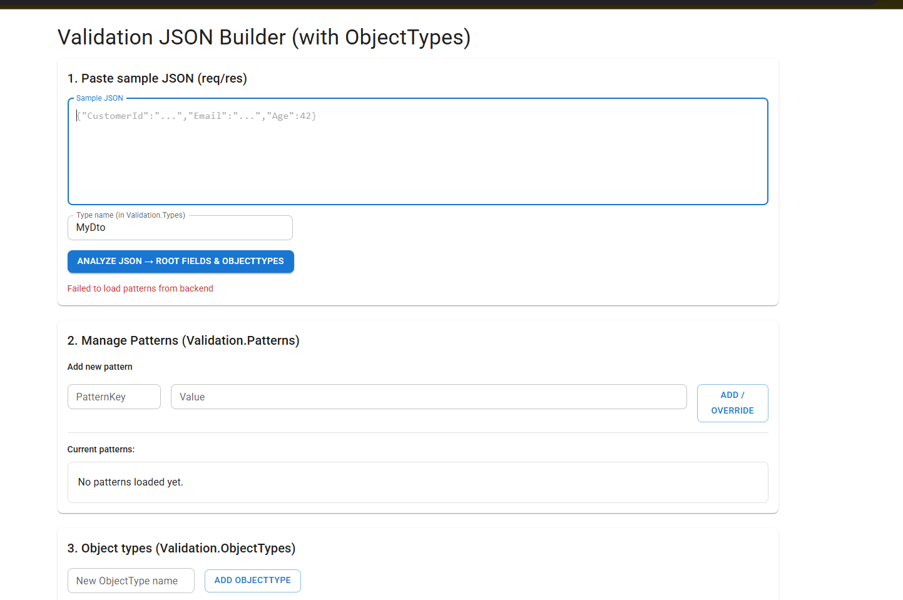

<h1 align="center">Validation JSON Builder 🧩</h1>

<p align="center">
  A visual builder for JSON validation configs with <strong>Patterns</strong>, <strong>ObjectTypes</strong>, wildcard paths, and full editing support.
</p>

<p align="center">
  
  
  
  
</p>

---

## 📸 Screenshots

> Replace the image files under `docs/screenshots/` with your real screenshots.

### Main Screen – From JSON to Validation

<p align="center">
  
</p>

### ObjectTypes Editor

<p align="center">
  
</p>

### Load & Edit Existing Validation JSON

<p align="center">
  
</p>

---

## 🚀 Overview

This project is a React-based interactive tool for building **Validation JSON configuration files**.

The generated structure looks like:

```json
{
  "Validation": {
    "Patterns": {
      "AlphaNumeric": "regex:^[A-Za-z0-9]+$",
      "Email": "regex:^[^@\\s]+@[^@\\s]+\\.[^@\\s]+$"
    },
    "ObjectTypes": {
      "Role": {
        "name": { "Required": true },
        "permissions[*]": { "Required": true }
      }
    },
    "Types": {
      "MyDto": {
        "currentUser.roles[*]": {
          "Required": true,
          "ObjectType": "Role"
        },
        "system.name": {
          "Required": true,
          "PatternKey": "AlphaNumeric",
          "MinLength": 1,
          "MaxLength": 60
        }
      }
    }
  }
}
